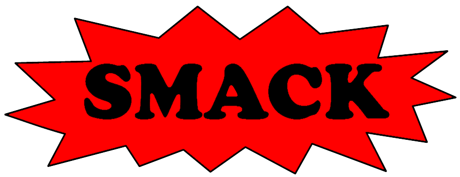

SMACK is both a *modular software verification toolchain* and a
*self-contained software verifier*. It can be used to verify the assertions
in its input programs. In its default mode, assertions are verified up to a
given bound on loop iterations and recursion depth; it contains experimental
support for unbounded verification as well. SMACK handles complicated feature
of the C language, including dynamic memory allocation, pointer arithmetic, and
bitwise operations.

Under the hood, SMACK is a translator from the [LLVM](http://www.llvm.org)
compiler's popular intermediate representation (IR) into the
[Boogie](https://github.com/boogie-org/boogie) intermediate verification language (IVL).
Sourcing LLVM IR exploits an increasing number of compiler front-ends,
optimizations, and analyses. Currently SMACK only supports the C language via
the [Clang](http://clang.llvm.org) compiler, though we are working on providing
support for additional languages. Targeting Boogie exploits a canonical
platform which simplifies the implementation of algorithms for verification,
model checking, and abstract interpretation. Currently, SMACK leverages the
[Boogie](https://github.com/boogie-org/boogie) and [Corral](https://github.com/boogie-org/corral)
verifiers.

See below for system requirements, installation, usage, and everything else.

*We are very interested in your experience using SMACK. Please do contact
[Zvonimir](mailto:zvonimir@cs.utah.edu) or
[Michael](mailto:michael.emmi@gmail.com) with any possible feedback.*

### Support

* For general questions, first consult the [FAQ](docs/faq.md).

* If something is otherwise broken or missing, open an [issue](https://github.com/smackers/smack/issues).

* As a last resort, send mail to 
  [Michael](mailto:michael.emmi@gmail.com), [Zvonimir](mailto:zvonimir@cs.utah.edu), or both.

* To stay informed about updates, you can watch SMACK's Github page.

### Acknowledgements

SMACK project has been partially supported by funding from the National Science
Foundation, VMware, Amazon, and Microsoft Research. We also rely on University of
Utah's [Emulab](http://www.emulab.net/) infrastructure for extensive
benchmarking of SMACK.

### Table of Contents

1. [System Requirements and Installation](docs/installation.md)
1. [Running SMACK](docs/running.md)
1. [Demos](docs/demos.md)
1. [FAQ](docs/faq.md)
1. [Inline Boogie Code](docs/boogie-code.md)
1. [Contribution Guidelines](CONTRIBUTING.md)
1. [Projects](docs/projects.md)
1. [Publications](docs/publications.md)
1. [People](docs/people.md)

